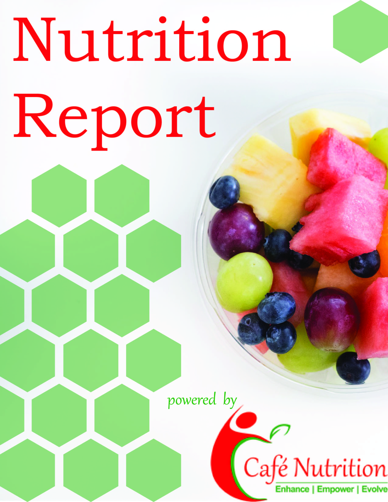
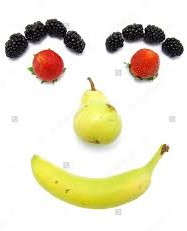

---
output:
  pdf_document:
    fig_caption: FALSE
    
  html_document:
    df_print: paged
---

```{r setup, include=FALSE}
knitr::opts_chunk$set(echo = FALSE, message = FALSE, warning = FALSE, fig.align = "center")
```


```{r, include=FALSE}
#Libraries
library(pander)
library(ggplot2)
library(tidyverse)
library(gridExtra)
library(latexpdf)

```
\pagenumbering{gobble}

```{r, fig.align="centre", results="asis"}
# Title Page
cat("")

```

\newpage

```{r fig.align='centre'}
#Ideal Nutrition Graph

Total_Nutrition <- c(".", ".")
Type <- c("Your Score", "Ideal Score")
Score <- c(subgroup$total_points, 50)
#Score <- c(subgroup$total_points, 50 - subgroup$total_points)
data <- data.frame(Total_Nutrition, Type, Score)
name <- paste(subgroup$proper_first_name,"'s", sep="")

cat("\n")
cat("\n")
cat("\n")
cat("\n")

#ggplot(data, aes(x = Total_Nutrition , y = Score, fill = Type)) +
 ggplot(data, aes(x = Type , y = Score)) +
  geom_bar(stat = "identity",fill="#b6cee2", color="blue",width = 0.5) +
  ggtitle(paste(name,"Nutrition Score")) +
  geom_text(aes(label=Score), vjust=-0.5, size=3.5)+
  theme(plot.title = element_text(hjust = 0.5))+
  labs(x="Nutrition Score")

```

Your child `r subgroup$proper_first_name` has a total nutrition score of `r subgroup$total_points` out of 50 possible points. Read on to know what you're doing well and how you can get even better

```{r, fig.width=15, fig.height=18}

#Protein
Protein <- c(".", ".")
Type <- c("Your Protein Score", "Ideal Protein Score")
Score <- c(subgroup$protein_total_points, 10 - subgroup$protein_total_points)
data <- data.frame(Protein, Type, Score)

p  <- ggplot(data, aes(x = Protein, y = Score, fill = Type)) +
  geom_bar(stat = "identity") +
  guides(fill=FALSE) +
  ggtitle("Protein") +
  theme(axis.title.x=element_blank(),
        axis.text.x=element_blank(),
        axis.ticks.x=element_blank(),
        plot.title = element_text(size=30, hjust = 0.5),
        axis.title.y = element_blank(),
        axis.text.y=element_blank(),
        axis.ticks.y=element_blank())
  
#Dairy
Dairy <- c(".", ".")
Type <- c("Your Dairy Score", "Ideal Dairy Score")
Score <- c(subgroup$dairy_total_points, 10 - subgroup$dairy_total_points)
data <- data.frame(Dairy, Type, Score)

d  <- ggplot(data, aes(x = Dairy, y = Score, fill = Type)) +
  geom_bar(stat = "identity") +
  guides(fill=FALSE) +
  ggtitle("Dairy") +
  theme(axis.title.x=element_blank(),
        axis.text.x=element_blank(),
        axis.ticks.x=element_blank(),
        plot.title = element_text(size=30, hjust = 0.5),
        axis.title.y = element_blank(),
        axis.text.y=element_blank(),
        axis.ticks.y=element_blank())
    
#Vegetables
Vegetables <- c(".", ".")
Type <- c("Your Vegetable Score", "Ideal Vegetable Score")
Score <- c(subgroup$vegetables_points, 4 - subgroup$vegetables_points)
data <- data.frame(Vegetables, Type, Score)

v  <- ggplot(data, aes(x = Vegetables, y = Score, fill = Type)) +
  geom_bar(stat = "identity") +
  guides(fill=FALSE) +
  ggtitle("Vegetables") +
  theme(axis.title.x=element_blank(),
        axis.text.x=element_blank(),
        axis.ticks.x=element_blank(),
        plot.title = element_text(size=30, hjust = 0.5),
        axis.title.y = element_blank(),
        axis.text.y=element_blank(),
        axis.ticks.y=element_blank())

#Fruits
Fruit <- c(".", ".")
Type <- c("Your Fruit Score", "Ideal Fruit Score")
Score <- c(subgroup$fruits_points, 4 - subgroup$fruits_points)
data <- data.frame(Fruit, Type, Score)

f  <- ggplot(data, aes(x = Fruit, y = Score, fill = Type)) +
  geom_bar(stat = "identity") +
  guides(fill=FALSE) +
  ggtitle("Fruits") +
  theme(axis.title.x=element_blank(),
        axis.text.x=element_blank(),
        axis.ticks.x=element_blank(),
        plot.title = element_text(size=30, hjust = 0.5),
        axis.title.y = element_blank(),
        axis.text.y=element_blank(),
        axis.ticks.y=element_blank())

#No Junk
Junk_Food <- c(".", ".")
Type <- c("Your Junk Score", "Ideal Junk Score")
Score <- c(subgroup$healthy_points, 8 - subgroup$healthy_points)
data <- data.frame(Junk_Food, Type, Score)
j  <- ggplot(data, aes(x = Junk_Food, y = Score, fill = Type)) +
  geom_bar(stat = "identity") +
  guides(fill=FALSE) +
  ggtitle("Junk Food") +
  theme(axis.title.x=element_blank(),
        axis.text.x=element_blank(),
        axis.ticks.x=element_blank(),
        plot.title = element_text(hjust = 0.5, size=30),
        axis.title.y = element_blank(),
        axis.text.y=element_blank(),
        axis.ticks.y=element_blank())


#Excercise
Exercise <- c(".", ".")
Type <- c("Your e Score", "Ideal e Score")
Score <- c(subgroup$exercise_points, 4 - subgroup$exercise_points)
data <- data.frame(Exercise, Type, Score)
e  <- ggplot(data, aes(x = Exercise, y = Score, fill = Type)) +
  geom_bar(stat = "identity") +
  guides(fill=FALSE) +
  ggtitle("Excercise") +
  theme(axis.title.x=element_blank(),
        axis.text.x=element_blank(),
        axis.ticks.x=element_blank(),
        axis.title.y = element_blank(),
        plot.title = element_text(size = 30, hjust = 0.5),
        axis.text.y=element_blank(),
        axis.ticks.y=element_blank())


#FOR SOME Inexplicable reason, have to switch scores around here
#Score <- c(4 - subgroup$screen_p, subgroup$screen_p)
#Screen
Screen <- c(".", ".")
Type <- c("m", "p")
Score <- c(subgroup$screen_points, 4- subgroup$screen_points)
data <- data.frame(Screen, Type, Score)

s  <- ggplot(data, aes(x = Screen, y = Score, fill = Type)) +
  geom_bar(stat = "identity") +
  guides(fill=FALSE) +
  ggtitle("Screen Time") +
  theme(axis.title.x=element_blank(),
        axis.text.x=element_blank(),
        axis.ticks.x=element_blank(),
        plot.title = element_text(size=30, hjust = 0.5),
        axis.title.y = element_blank(),
        axis.text.y=element_blank(),
        axis.ticks.y=element_blank()
        )

#Water
Water <- c(".", ".")
Type <- c("o", "l")
Score <- c(subgroup$water_p, 4 - subgroup$water_p)

data <- data.frame(Water, Type, Score)

w  <- ggplot(data, aes(x = Water, y = Score, fill = Type)) +
  geom_bar(stat = "identity") +
  ggtitle("Water") +
  guides(fill=FALSE) +
  theme(axis.title.x=element_blank(),
        axis.text.x=element_blank(),
        axis.ticks.x=element_blank(),
        plot.title = element_text(size=30, hjust = 0.5),
        axis.title.y = element_blank(),
        axis.text.y=element_blank(),
        axis.ticks.y=element_blank())


grid.arrange(p,d, v, f, j,e, s, w, ncol = 2)

```

```{r, results = 'asis'}
cat("A higher proportion of blue green indicates better performance. For example, blue/green in vegetables indicates that your child is getting enough vegetables, while more blue/green in junk food and screen indicates your child is getting *less* junk and screen time")
```

```{r, results = 'asis'}

protein <- paste("##", "Protein")
protein_g <- paste(subgroup$proper_first_name, "is getting enough protein. This is great because protein repairs your builds and repairs body tissue and organs, especially vital at this age. Proteins also form antibodies that help prevent infection, illness, and disease. Good job at keeping", subgroup$proper_first_name, "healthy and safe!")
protein_b <- paste(subgroup$proper_first_name, "needs to get more protein. Protein repairs your builds and repairs body tissue and organs, especially vital at this age. Proteins also form antibodies that help prevent infection, illness, and disease. The following foods contain")
protein_1 <- paste("*", "Dals and beans")
protein_2 <- paste("*", "Nuts and seeds")
protein_3 <- paste("*", "Eggs and poultry")
protein_4 <- paste("*", "Fish")


dairy <- paste("##", "Dairy")
dairy_g <- paste("Getting enough dairy is not a problem for", subgroup$proper_first_name, ". Dairy and dairy-containing foods contribute many essential nutrients. Calcium and Vitamin D, especially, are  most easily absorbed from dairy.Both these nutrients are important in ensuring that", subgroup$proper_first_name, "has healthy bones and teeth")
dairy_b <- paste(subgroup$proper_first_name, "could do with some more dairy. Dairy and dairy-containing foods contribute many essential nutrients. Calcium and Vitamin D, especially, are  most easily absorbed from dairy.Both these nutrients are important in ensuring that", subgroup$proper_first_name, "has healthy bones and teeth. You could squeeze in a serving as a snack in the evening, or a cup of yogurt post the evening play. Here are some other tips to increase", subgroup$his_and_her, "dairy intake:")
dairy_1 <- paste("*", "Add milk in homemade puddings or fruit custards. You can control sugar with homemade stuff.")
dairy_2 <- paste("*", "Parathas with paneer")
dairy_3 <- paste("*", "Cheese cubes with fruit can be a great snack")
dairy_4 <- paste("*", "Smoothies and milkshakes are good options as well")


fruit <- paste("##", "Fruits")
fruit_g <- paste(subgroup$proper_first_name, "is getting enough fruit. Fruits give you sustainable energy, unlike sugar highs that last a few hours or less. Fruits also have many micronutrients. For example, citrus fruits and strawberries are rich in immune system-boosting vitamin C. Apples contain 16 different polyphenols, which are antioxidants with health-promoting properties. Eating fruits and vegetables in a rainbow of colors will provide a wide range of nutrients that will help keep", subgroup$proper_first_name, "healthy" )
fruit_b <- paste("It would be great if you could include more fruits in", subgroup$proper_first_name, "'s diet. Fruits give you sustainable energy, unlike sugar highs that last a few hours or less. Fruits also have many micronutrients. For example, citrus fruits and strawberries are rich in immune system-boosting vitamin C. Apples contain 16 different polyphenols, which are antioxidants with health-promoting properties.")
fruit_1 <- paste("*", "Try food smoothies or milkshakes as snacks" )
fruit_2 <- paste("*", "Add fruits to salads which will make salad colourful and appealing" )
fruit_3 <- paste("*", "Maybe add fruit to yogurt")
fruit_4 <- paste("*", "You can sprinkle chaat masala on fruits to improve how they taste" )
fruit_5 <- paste("*", "Fruits can be added to cereal or porridge and to pancakes" )


veg <- paste("##", "Vegetables")
veg_g <- paste("Good job!", subgroup$proper_first_name, "is getting", subgroup$his_and_her, "share of vegetables. They have nutrients that can boost immunity and keep ailments like a common cold and flu at bay. It's especially important that", subgroup$proper_first_name, "is eating vegetables at this early age because food tastes are formed young. Eating vegetables in a rainbow of colors will provide a wide range of nutrients that will help keep", subgroup$proper_first_name, "healthy")
veg_b <- paste(subgroup$proper_first_name, "could do with more vegetables in", subgroup$his_and_her, "diet. They have nutrients that can boost immunity and keep ailments like a common cold and flu at bay. It's especially important that", subgroup$proper_first_name, "is eating vegetables at this early age because food tastes are formed young. Eating vegetables in a rainbow of colors will provide a wide range of nutrients that will help keep", subgroup$proper_first_name, "healthy")
veg_1 <- paste("*", "Include vegetables in almost all foods (finely chopped if necessary)")
veg_2 <- paste("*", "Offer vegetable sticks like cucumber and carrots with curd dips or hummus")
veg_3 <- paste("*", "Add slices of cucumber, capsicum, grated carrot and lettuce to sandwiches")
veg_4 <- paste("*", "Use pureed or grated vegetables in pasta sauces or soups")
veg_5 <- paste("*", "Include them in parathas (even aloo parathas can have other mashed vegetables)")
veg_6 <- paste("*", "Keep trying. It takes almost 10 times before children warm up to a particular food")


junk <- paste("##", "Junk Food")
junk_g <- paste("Unlike most kids, you are keeping", subgroup$proper_first_name, "'s fried and sugary intake to a minimum. Good job! Apart from promoting obesity and cardiac disease, sugar can have a harmful effect on academic performace. In an interesting study researchers fed normal preschoolers a high-sugar drink containing the amount of sugar in the average can of soda and compared them with children who received a non-sugar drink. The sugar group experienced decreased learning performance and more hyperactivity than the non-sugar group.")
junk_b <- paste(subgroup$proper_first_name, "could reduce", subgroup$his_and_her, "consumption of sweet and/or fried food. Apart from promoting obesity and cardiac disease, sugar can have a harmful effect on academic performace. In an interesting study, researchers fed normal preschoolers a high-sugar drink containing the amount of sugar in the average can of soda and compared them with children who received a non-sugar drink. The sugar group experienced decreased learning performance and more hyperactivity than the non-sugar group. Here are some strateges for how to do that")
junk_1 <- paste( "*", "Parents - lead by example. If children see you snacking on sweet foods and drinks they will follow you")
junk_2 <- paste( "*", " Set a specific day and mealtime for dessert")
junk_3 <- paste( "*", "Offer sweet fruits or dried fruits as snacks")
junk_4 <- paste( "*", "Buy plain yogurt instead of the flavoured one and sweeten it with dried fruits or berries to enhance the taste")
junk_5 <- paste( "*", "Stock your home with healthy snacking options like dried fruits, nuts, fruits and vegetables with dips like hummus and curd dips etc")
junk_6 <- paste("*", "Cook healthier alternatives of junk food eg baked fries instead of frying them, homemade pizzas with the healthy base and sauce, homemade burgers, whole wheat pastas, etc ")


exercise <- paste("##", "Exercise")
exercise_g <- paste(subgroup$proper_first_name, "seems to be getting enough physical activity. This is especially important at a young age because physical (body) and cognitive (brain) development go hand-in-hand. While this continues for life, this relationship is most critical at a young age. When kids are active, their brain develops, allowing for new types of activity. Frequent physical activity has been associated with improved behavior in the classroom and beyond. Aerobic activity has been shown to increase the size of essential brain structures and number of neural connections.")
exercise_b <- paste("Getting more  physical activity would be good for", subgroup$proper_first_name, "This is especially important at a young age because physical (body) and cognitive (brain) development go hand-in-hand. While this continues for life, this relationship is most critical at a young age. When kids are active, their brain develops, allowing for new types of activity. Frequent physical activity has been associated with improved behavior in the classroom and beyond. Aerobic activity has been shown to increase the size of essential brain structures and number of neural connections. Here are a few things you could do to encourage more physical activty.")
ex_1 <- paste("*", "Most importantly be a role good model. If children see you being active they will follow suit. ")
ex_2 <- paste("*", "You could initiate forming a play group with other children")
ex_3 <- paste("*", "Walk short distances with the child instead of taking a vehicle")
ex_4 <- paste("*", "Decrease screen time as hand held devices, computers and mobile phones for a few hours may reduce active play time")


screens <- paste("##", "Screen Time")
screen_g <- paste(subgroup$proper_first_name, "is a rare gem. The majority of kids spend hours on screens. Excessive screen time at a young age can be harmful in many ways. For example, tablets are the ultimate shortcut tools. Unlike a mother reading a story to a child, for example, a smartphone-told story spoon-feeds images, words, and pictures all at once to a young reader. Rather than having to take the time to process a mother’s voice into words, visualize complete pictures and exert a mental effort to follow a story line, kids who follow stories on their smartphones get lazy. The device does the thinking for them, and as a result, their own cognitive muscles remain weak.")
screen_b <- paste("It would be good for", subgroup$proper_first_name, "to spend less time on screens. Excessive screen time at a young age can be harmful in many ways. For example, tablets are the ultimate shortcut tools. Unlike a mother reading a story to a child, for example, a smartphone-told story spoon-feeds images, words, and pictures all at once to a young reader. Rather than having to take the time to process a mother’s voice into words, visualize complete pictures and exert a mental effort to follow a story line, kids who follow stories on their smartphones get lazy. The device does the thinking for them, and as a result, their own cognitive muscles remain weak.")
screen_1 <- paste("*", "You could replace time spent on screen by encouraging", subgroup$proper_first_name, "to spend more time playing. Maybe join a sports class or group?")


water <- paste("## Water")
water_g <- paste(subgroup$proper_first_name, "is getting enough water. Let this continue as kids don't always recognise the early stages of thirst, which can make them particularly vulnerable to becoming dehydrated, especially during times that can drive up their body fluid losses, for example when they are playing sport or during warm weather. Dehydration, even if only mild, can cause tiredness, headaches, lack of concentration, reduced mental performance and dry skin.")
water_b <- paste(subgroup$proper_first_name, "is not getting enough water. Kids don't always recognise the early stages of thirst, which can make them particularly vulnerable to becoming dehydrated, especially during times that can drive up their body fluid losses, for example when they are playing sport or during warm weather. Dehydration, even if only mild, can cause tiredness, headaches, lack of concentration, reduced mental performance and dry skin.  Here are a couple things you can try to make", subgroup$proper_first_name, "drink more water")
water_1 <- paste("*", "Diluting a fresh juice with some water is an option if the child is not willing to drink water voluntarily")
water_2 <- paste("*", "Actively encourage them to drink more and lead by example")

```

\newpage
```{r, results="asis"}
  
cat("#", "Things You're Doing Well", "\n")
cat("\n")
cat("\n")

if(subgroup$protein_total_points== 10){
  cat(protein)
  cat("\n")
  cat("\n")
  cat(protein_g)
  cat("\n")
  cat("\n")
}

if(subgroup$dairy_total_points == 10){
  cat(dairy)
  cat("")
  cat("\n")
  cat("\n")
  cat(dairy_g)
  cat("\n")
  cat("\n")
}

if(subgroup$vegetables_points == 4){
  cat(veg)
  cat("")
  cat("\n")
  cat("\n")
  cat(veg_g)
  cat("\n")
  cat("\n")
}

if(subgroup$fruits_points == 4){
  cat(fruit)
  cat("")
  cat("\n")
  cat("\n")
  cat(fruit_g)
  cat("\n")
  cat("\n")
}

if(subgroup$healthy_points == 8){
  cat(junk)
  cat("")
  cat("\n")
  cat("\n")
  cat(junk_g)
  cat("\n")
  cat("\n")
}

if(subgroup$exercise_points == 4){
  cat(exercise)
  cat("\n")
  cat("\n")
  cat(exercise_g)
  cat("\n")
  cat("\n")
}

if(subgroup$screen_points == 4){
  cat(screens)
  cat("\n")
  cat("\n")
  cat(screen_g)
  cat("\n")
  cat("\n")
}

if(subgroup$water_points == 4){
  cat(water)
  cat("\n")
  cat("\n")
  cat(water_g)
  cat("\n")
  cat("\n")
}
```

\newpage
```{r, results="asis"}


cat("#", "Things You Could Improve at", "\n")

cat("Below are some tips on how you could improve", subgroup$proper_first_name, "health and nutrition. After going through the bulleted tips and your appointment with the nutritionist, we reccomend you selct 3-5 tips to focus on and improve over the next year")

cat("\n")
cat("\n")

if(subgroup$protein_total_points < 10){
  cat(protein)
  cat("\n")
  cat("\n")
  cat(protein_b)
  cat("\n")
  cat("\n")
  cat(protein_1)
  cat("\n")
  cat("\n")
  cat(protein_2)
  cat("\n")
  cat("\n")
  cat(protein_3)
  cat("\n")
  cat("\n")
  cat(protein_4)
  cat("\n")
  cat("\n")
}

if(subgroup$dairy_total_points < 10){
  cat(dairy)
  cat("")
  cat("\n")
  cat("\n")
  cat(dairy_b)
  cat("\n")
  cat("\n")
  cat(dairy_1)
  cat("\n")
  cat("\n")
  cat(dairy_2)
  cat("\n")
  cat("\n")
  cat(dairy_3)
  cat("\n")
  cat("\n")
}

if(subgroup$vegetables_points < 4){
  cat(veg)
  cat("")
  cat("\n")
  cat("\n")
  cat(veg_b)
  cat("\n")
  cat("\n")
  cat(veg_1)
  cat("\n")
  cat("\n")
  cat(veg_2)
  cat("\n")
  cat("\n")
  cat(veg_3)
  cat("\n")
  cat("\n")
  cat(veg_4)
  cat("\n")
  cat("\n")
  cat(veg_5)
  cat("\n")
  cat("\n")
  cat(veg_6)
  cat("\n")
  cat("\n")
}


if(subgroup$fruits_points < 4){
  cat(fruit)
  cat("")
  cat("\n")
  cat("\n")
  cat(fruit_b)
  cat("\n")
  cat("\n")
  cat(fruit_1)
  cat("\n")
  cat("\n")
  cat(fruit_2)
  cat("\n")
  cat("\n")
  cat(fruit_3)
  cat("\n")
  cat("\n")
  cat(fruit_4)
  cat("\n")
  cat("\n")
  cat(fruit_5)
  cat("\n")
  cat("\n")
}


if(subgroup$healthy_points < 8){
  cat(junk)
  cat("")
  cat("\n")
  cat("\n")
  cat(junk_b)
  cat("\n")
  cat("\n")
  cat(junk_1)
  cat("\n")
  cat("\n")
  cat(junk_2)
  cat("\n")
  cat("\n")
  cat(junk_3)
  cat("\n")
  cat("\n")
  cat(junk_4)
  cat("\n")
  cat("\n")
  cat(junk_5)
  cat("\n")
  cat("\n")
  cat(junk_6)
  cat("\n")
  cat("\n")
}


if(subgroup$exercise_points < 4){
  cat(exercise)
  cat("\n")
  cat("\n")
  cat(exercise_b)
  cat("\n")
  cat("\n")
   cat(ex_1)
  cat("\n")
  cat("\n")
  cat(ex_2)
  cat("\n")
  cat("\n")
  cat(ex_3)
  cat("\n")
  cat("\n")
  cat(ex_4)
  cat("\n")
  cat("\n")
}

if(subgroup$screen_points < 4){
  cat(screens)
  cat("\n")
  cat("\n")
  cat(screen_b)
  cat("\n")
  cat("\n")
  cat(screen_1)
  cat("\n")
  cat("\n")
}

if(subgroup$water_points < 4){
  cat(water)
  cat("\n")
  cat("\n")
  cat(water_b)
  cat("\n")
  cat("\n")
  cat(water_1)
  cat("\n")
  cat("\n")
  cat(water_2)
  cat("\n")
  cat("\n")
}

```

\newpage
```{r, fig.align="centre", results="asis"}
cat("")

```

\newpage
```{r, fig.align="centre", results="asis"}
cat("")

```
