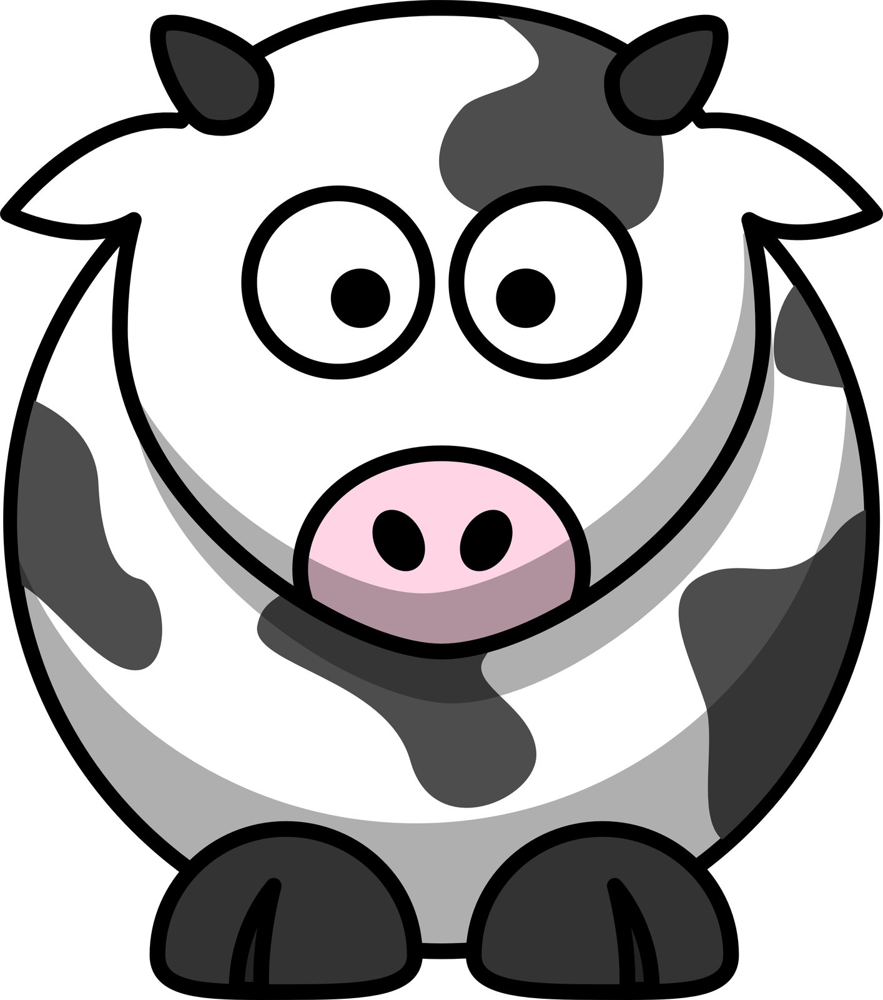
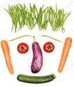
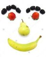
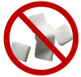
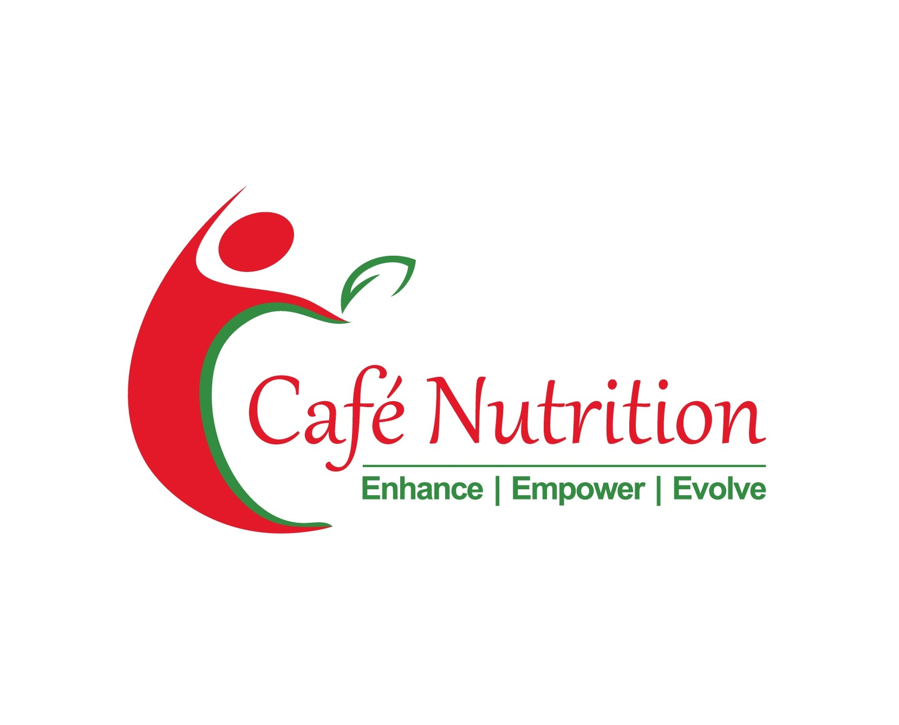

```{r setup, include=FALSE}
knitr::opts_chunk$set(echo = FALSE, message = FALSE, warning = FALSE)
```


```{r}
library(pander)
library(latex2exp)
library(latexpdf)
#library(tidyverse)
library(gridExtra)
library(ggplot2)

```


```{r fig.align="center", results = "asis"}
#cat(cns_logo.png)
cat("")
cat("\n")
cat("\n")

```

\newpage

```{r, warning = FALSE, message=FALSE }
#Graphs

Total_Nutrition <- c(".", ".")
Type <- c("Your Nutrition Score", "Ideal Score")
Score <- c(subgroup$total_s, 50 - subgroup$total_s)
data <- data.frame(Total_Nutrition, Type, Score)


cat("\n")
cat("\n")
cat("\n")
cat("\n")

ggplot(data, aes(x = Total_Nutrition, y = Score, fill = Type)) +
  geom_bar(stat = "identity") +
  ggtitle("Nutrition Score") +
  theme(plot.title = element_text(hjust = 0.5))

```


`r subgroup$proper_first_name` has a total nutrition score of `r subgroup$total_s` out of 50 possible points. Read on to know what you're doing well and how you can get even better

```{r, fig.width=15, fig.height=18, warning=FALSE, message=FALSE}

#Protein
Protein <- c(".", ".")
Type <- c("Your Protein Score", "Ideal Protein Score")
Score <- c(".", ".")
Score <- c(subgroup$prot_s, 10 - subgroup$prot_s)

data <- data.frame(Protein, Type, Score)

p  <- ggplot(data, aes(x = Protein, y = Score, fill = Type)) +
  geom_bar(stat = "identity") +
  guides(fill=FALSE) +
  ggtitle("Protein") +
  theme(axis.title.x=element_blank(),
        axis.text.x=element_blank(),
        axis.ticks.x=element_blank(),
        plot.title = element_text(size=30, hjust = 0.5),
        axis.title.y = element_blank(),
        axis.text.y=element_blank(),
        axis.ticks.y=element_blank())


#Dairy
Dairy <- c(".", ".")
Type <- c("Your Dairy Score", "Ideal Dairy Score")
Score <- c(subgroup$dairy_s, 5 - subgroup$dairy_s)


data <- data.frame(Dairy, Type, Score)

d  <- ggplot(data, aes(x = Dairy, y = Score, fill = Type)) +
  geom_bar(stat = "identity") +
  guides(fill=FALSE) +
  ggtitle("Dairy") +
  theme(axis.title.x=element_blank(),
        axis.text.x=element_blank(),
        axis.ticks.x=element_blank(),
        plot.title = element_text(size=30, hjust = 0.5),
        axis.title.y = element_blank(),
        axis.text.y=element_blank(),
        axis.ticks.y=element_blank())

#Vegetables
Vegetables <- c(".", ".")
Type <- c("Your Vegetable Score", "Ideal Vegetable Score")
Score <- c(subgroup$veg_s, 5 - subgroup$veg_s)

data <- data.frame(Vegetables, Type, Score)

v  <- ggplot(data, aes(x = Vegetables, y = Score, fill = Type)) +
  geom_bar(stat = "identity") +
  guides(fill=FALSE) +
  ggtitle("Vegetables") +
  theme(axis.title.x=element_blank(),
        axis.text.x=element_blank(),
        axis.ticks.x=element_blank(),
        plot.title = element_text(size=30, hjust = 0.5),
        axis.title.y = element_blank(),
        axis.text.y=element_blank(),
        axis.ticks.y=element_blank())

#Fruits
Fruit <- c(".", ".")
Type <- c("Your Fruit Score", "Ideal Fruit Score")
Score <- c(subgroup$fruit_s, 5 - subgroup$fruit_s)

data <- data.frame(Fruit, Type, Score)

f  <- ggplot(data, aes(x = Fruit, y = Score, fill = Type)) +
  geom_bar(stat = "identity") +
  guides(fill=FALSE) +
  ggtitle("Fruits") +
  theme(axis.title.x=element_blank(),
        axis.text.x=element_blank(),
        axis.ticks.x=element_blank(),
        plot.title = element_text(size=30, hjust = 0.5),
        axis.title.y = element_blank(),
        axis.text.y=element_blank(),
        axis.ticks.y=element_blank())


# Fast
Fast <- c(".", ".")
Type <- c("your  Potato ", "ideal potato")

Score <- c(subgroup$fast_s, 5 - subgroup$fast_s)

data <- data.frame(Fast, Type, Score)

fa  <- ggplot(data, aes(x = Fast, y = Score, fill = Type)) +
  geom_bar(stat = "identity") +
  guides(fill=FALSE) +
  ggtitle("Fast Food") +
  theme(axis.title.x=element_blank(),
        axis.text.x=element_blank(),
        axis.ticks.x=element_blank(),
        plot.title = element_text(size=30, hjust = 0.5),
        axis.title.y = element_blank(),
        axis.text.y=element_blank(),
        axis.ticks.y=element_blank()
        )

#Sweet

Sweet_Food <- c(".", ".")
Type <- c("Your Junk Score", "Ideal Junk Score")
Score <- c(subgroup$sweet_s, 5 - subgroup$sweet_s)

data <- data.frame(Sweet_Food, Type, Score)

s  <- ggplot(data, aes(x = Sweet_Food, y = Score, fill = Type)) +
  geom_bar(stat = "identity") +
  guides(fill=FALSE) +
  ggtitle("Sweet Food") +
  theme(axis.title.x=element_blank(),
        axis.text.x=element_blank(),
        axis.ticks.x=element_blank(),
        plot.title = element_text(hjust = 0.5, size=30),
        axis.title.y = element_blank(),
        axis.text.y=element_blank(),
        axis.ticks.y=element_blank())


#Excercise

Excercise <- c(".", ".")
Type <- c("Your e Score", "Ideal e Score")
Score <- c(subgroup$exercise_s, 5 - subgroup$exercise_s)

data <- data.frame(Excercise, Type, Score)

e  <- ggplot(data, aes(x = Excercise, y = Score, fill = Type)) +
  geom_bar(stat = "identity") +
  guides(fill=FALSE) +
  ggtitle("Excercise") +
  theme(axis.title.x=element_blank(),
        axis.text.x=element_blank(),
        axis.ticks.x=element_blank(),
        axis.title.y = element_blank(),
        plot.title = element_text(size = 30, hjust = 0.5),
        axis.text.y=element_blank(),
        axis.ticks.y=element_blank())


#Water

Water <- c(".", ".")
Type <- c("o", "l")
Score <- c(subgroup$water_s, 5 - subgroup$water_s)

data <- data.frame(Water, Type, Score)

w  <- ggplot(data, aes(x = Water, y = Score, fill = Type)) +
  geom_bar(stat = "identity") +
  ggtitle("Water") +
  guides(fill=FALSE) +
  theme(axis.title.x=element_blank(),
        axis.text.x=element_blank(),
        axis.ticks.x=element_blank(),
        plot.title = element_text(size=30, hjust = 0.5),
        axis.title.y = element_blank(),
        axis.text.y=element_blank(),
        axis.ticks.y=element_blank())


grid.arrange(p,d, v, f, s, fa, e, w, ncol = 2)


```
```{r, results = 'asis'}
cat("A higher proportion of blue green indicates better performance. For example, blue/green in vegetables indicates that your child is getting enough vegetables, while more blue/green in junk food and screen indicates your child is getting *less* junk and screen time")
```
\newpage


```{r, results = 'asis'}
good <- paste("Here are some things that", subgroup$proper_first_name, "is doing well. Keep them up")

protein <- paste("##", "Protein")
protein_g <- paste(subgroup$proper_first_name, "is getting enough protein. This is great because protein repairs your builds and repairs body tissue and organs, especially vital at this age. Proteins also form antibodies that help prevent infection, illness, and disease. Good job at keeping", subgroup$proper_first_name, "healthy and safe!")
protein_ba <- paste(subgroup$proper_first_name, "needs to get more protein. Protein repairs your builds and repairs body tissue and organs, especially vital at this age. Proteins also form antibodies that help prevent infection, illness, and disease. The following foods contain protein:")
protein_1a <- paste("*", "Dals and beans")
protein_2a <- paste("*", "Nuts and seeds")
protein_3a <- paste("*", "Eggs and poultry")
protein_4a<- paste("*", "Fish")
protein_bb <- paste("Protein intake is more than the recommended protein requirement for the age. Extra protein can cause an increase in fat mass in the child and extra protein does not necessarily lead to stronger muscles and bones later. Though protein is good for children, high intake would mean compromising on rest of the essential food groups. You could analyse the diet with the nutritionist to understand those foods that can be reduced eg.")
protein_1b <- paste("* The child may be having extra servings from the dairy group")
protein_2b <- paste("* There may be more reliance on the foods from the egg and meat section and less from the vegetable and fruit group")


dairy <- paste("##", "Dairy")
dairy_g <- paste("Getting enough dairy is not a problem for", subgroup$proper_first_name, ". Dairy and dairy-containing foods contribute many essential nutrients. Calcium and Vitamin D, especially, are  most easily absorbed from dairy.Both these nutrients are important in ensuring that", subgroup$proper_first_name, "has healthy bones and teeth")
dairy_ba <- paste(subgroup$proper_first_name, "could do with some more dairy. Dairy and dairy-containing foods contribute many essential nutrients. Calcium and Vitamin D, especially, are  most easily absorbed from dairy.Both these nutrients are important in ensuring that", subgroup$proper_first_name, "has healthy bones and teeth. You could squeeze in a serving as a snack in the evening, or a cup of yogurt post the evening play. Here are some other tips to increase", subgroup$his_and_her, "dairy intake:")
dairy_1a <- paste("*", "Add milk in homemade puddings or fruit custards. You can control sugar with homemade stuff.")
dairy_2a <- paste("*", "Parathas with paneer")
dairy_3a <- paste("*", "Cheese cubes with fruit can be a great snack")
dairy_4a <- paste("*", "Smoothies and milkshakes are good options as well")
dairy_bb <- paste(subgroup$proper_first_name, " is currently having more of dairy foods than what is needed at", subgroup$his_her, "age. Yes, dairy is good for growing children to help maintain strong teeth and bones, but including too much can mean filling up the children and increasing the chances that they forgo other nutrient rich foods. You could analyse the diet with the nutritionist and make the following changes if applicable:")
dairy_1b <- paste("* Reduce the intake of milk if he/she is having more than 3 servings of milk per day")
dairy_2b <- paste("* Restrict the intake of cheese if it is added to almost all foods (after all cheese can increase the total calorie intake even in children")


fruit <- paste("##", "Fruits")
fruit_g <- paste(subgroup$proper_first_name, "is getting enough fruit. Fruits give you sustainable energy, unlike sugar highs that last a few hours or less. Fruits also have many micronutrients. For example, citrus fruits and strawberries are rich in immune system-boosting vitamin C. Apples contain 16 different polyphenols, which are antioxidants with health-promoting properties. Eating fruits and vegetables in a rainbow of colors will provide a wide range of nutrients that will help keep", subgroup$proper_first_name, "healthy" )
fruit_b <- paste("It would be great if you could include more fruits in", subgroup$proper_first_name, "'s diet. Fruits give you sustainable energy, unlike sugar highs that last a few hours or less. Fruits also have many micronutrients. For example, citrus fruits and strawberries are rich in immune system-boosting vitamin C. Apples contain 16 different polyphenols, which are antioxidants with health-promoting properties.")
fruit_1 <- paste("*", "Try food smoothies or milkshakes as snacks" )
fruit_2 <- paste("*", "Add fruits to salads which will make salad colourful and appealing" )
fruit_3 <- paste("*", "Maybe add fruit to yogurt")
fruit_4 <- paste("*", "You can sprinkle chaat masala on fruits to improve how they taste" )
fruit_5 <- paste("*", "Fruits can be added to cereal or porridge and to pancakes" )


veg <- paste("##", "Vegetables")
veg_g <- paste("Good job!", subgroup$proper_first_name, "is getting", subgroup$his_and_her, "share of vegetables. They have nutrients that can boost immunity and keep ailments like a common cold and flu at bay. It's especially important that", subgroup$proper_first_name, "is eating vegetables at this early age because food tastes are formed young. Eating vegetables in a rainbow of colors will provide a wide range of nutrients that will help keep", subgroup$proper_first_name, "healthy")
veg_b <- paste(subgroup$proper_first_name, "could do with more vegetables in", subgroup$his_and_her, "diet. They have nutrients that can boost immunity and keep ailments like a common cold and flu at bay. It's especially important that", subgroup$proper_first_name, "is eating vegetables at this early age because food tastes are formed young. Eating vegetables in a rainbow of colors will provide a wide range of nutrients that will help keep", subgroup$proper_first_name, "healthy")
veg_1 <- paste("*", "Include vegetables in almost all foods (finely chopped if necessary)")
veg_2 <- paste("*", "Offer vegetable sticks like cucumber and carrots with curd dips or hummus")
veg_3 <- paste("*", "Add slices of cucumber, capsicum, grated carrot and lettuce to sandwiches")
veg_4 <- paste("*", "Use pureed or grated vegetables in pasta sauces or soups")
veg_5 <- paste("*", "Include them in parathas (even aloo parathas can have other mashed vegetables)")
veg_6 <- paste("*", "Keep trying. It takes almost 10 times before children warm up to a particular food")

sweet <- paste("##", "Sweet Food")
sweet_g <- paste("We are happy to notice that unlike other children", subgroup$proper_first_name, "is keeping", subgroup$his_her, "intake of sugar to a minimum. Apart from promoting obesity and cardiac disease, sugar can have a harmful impact on academic performance. In an interesting study researchers fed normal preschoolers a high-sugar drink containing the amount of sugar in the average can of soda and compared them with children who received a non-sugar drink. The sugar group experienced decreased learning performance and more hyperactivity than the non-sugar group. So, great job!")
sweet_b <- paste(subgroup$proper_first_name, "needs to keep a tab on the intake of sugar based foods. High intake can affect the bone development, the brain activity and contribute to unnecessary empty calorie intake. It has been well documented in various studies that high intake of sugar in foods decreases attention span and memory. Some things you can do as a parent to reduce the intake of sugar in", subgroup$his_her, "diet")
sweet_1 <- paste( "*", "Parents - lead by example. If children see you snacking on sweet foods and drinks they will follow you")
sweet_2 <- paste( "*", " Set a specific day and mealtime for dessert")
sweet_3 <- paste( "*", "Offer sweet fruits or dried fruits as snacks")
sweet_4 <- paste( "*", "Buy plain yogurt instead of the flavoured one and sweeten it with dried fruits or berries to enhance the taste")

fast <- paste("##", "Fast Food")
fast_g <- paste("Excellent! In comparison to other children,", subgroup$proper_first_name, "'s intake of the processed and junk food is in check. These foods are high in fats and sugars and low in fiber. Healthy eating habits affects children’s physical, mental and physical growth through the essential growing years. And keeping a check on the intake now will only pave for a healthier life during adulthood.")
fast_b <- paste(subgroup$proper_first_name, "seems to be getting more of junk and processed foods in", subgroup$his_her, "diet. Junk food is appealing to most children. However, regularly consuming fattening junk food can be addictive for children and lead to complications like obesity, chronic illness as well as affecting how they perform in school and extracurricular activities. Some strategies to help make healthier choices are:")
fast_1 <- paste( "*", "Stock your home with healthy snacking options like dried fruits, nuts, fruits and vegetables with dips like hummus and curd dips etc")
fast_2 <- paste("*", "Cook healthier alternatives of junk food eg baked fries instead of frying them, homemade pizzas with the healthy base and sauce, homemade burgers, whole wheat pastas, etc ")


exercise <- paste("##", "Exercise")
exercise_g <- paste(subgroup$proper_first_name, "seems to be getting enough physical activity. This is especially important at a young age because physical (body) and cognitive (brain) development go hand-in-hand. While this continues for life, this relationship is most critical at a young age. When kids are active, their brain develops, allowing for new types of activity. Frequent physical activity has been associated with improved behavior in the classroom and beyond. Aerobic activity has been shown to increase the size of essential brain structures and number of neural connections.")
exercise_b <- paste("Getting more  physical activity would be good for", subgroup$proper_first_name, "This is especially important at a young age because physical (body) and cognitive (brain) development go hand-in-hand. While this continues for life, this relationship is most critical at a young age. When kids are active, their brain develops, allowing for new types of activity. Frequent physical activity has been associated with improved behavior in the classroom and beyond. Aerobic activity has been shown to increase the size of essential brain structures and number of neural connections. Here are a few things you could do to encourage more physical activty.")
ex_1 <- paste("*", "Most importantly be a role good model. If children see you being active they will follow suit. ")
ex_2 <- paste("*", "You could initiate forming a play group with other children")
ex_3 <- paste("*", "Walk short distances with the child instead of taking a vehicle")
ex_4 <- paste("*", "Decrease screen time as hand held devices, computers and mobile phones for a few hours may reduce active play time")


water <- paste("## Water")
water_g <- paste(subgroup$proper_first_name, "is getting enough water. Let this continue as kids don't always recognise the early stages of thirst, which can make them particularly vulnerable to becoming dehydrated, especially during times that can drive up their body fluid losses, for example when they are playing sport or during warm weather. Dehydration, even if only mild, can cause tiredness, headaches, lack of concentration, reduced mental performance and dry skin.")
water_b <- paste(subgroup$proper_first_name, "is not getting enough water. Kids don't always recognise the early stages of thirst, which can make them particularly vulnerable to becoming dehydrated, especially during times that can drive up their body fluid losses, for example when they are playing sport or during warm weather. Dehydration, even if only mild, can cause tiredness, headaches, lack of concentration, reduced mental performance and dry skin.  Here are a couple things you can try to make", subgroup$proper_first_name, "drink more water")
water_1 <- paste("*", "Diluting a fresh juice with some water is an option if the child is not willing to drink water voluntarily")
water_2 <- paste("*", "Actively encourage them to drink more and lead by example")

```

\newpage

```{r, results="asis"}
cat("#", "Things You're Doing Well", "\n")
cat("\n")
cat("\n")

if(subgroup$prot_s == 10){
  cat(protein)
  cat("\n")
  cat("\n")
  cat(protein_g)
  cat("\n")
  cat("\n")
}

if(subgroup$dairy_s == 5){
  cat(dairy)
  cat("")
  cat("\n")
  cat("\n")
  cat(dairy_g)
  cat("\n")
  cat("\n")
}

if(subgroup$veg_s == 5){
  cat(veg)
  cat("")
  cat("\n")
  cat("\n")
  cat(veg_g)
  cat("\n")
  cat("\n")
}


if(subgroup$fruit_s == 5){
  cat(fruit)
  cat("")
  cat("\n")
  cat("\n")
  cat(fruit_g)
  cat("\n")
  cat("\n")
}


if(subgroup$sweet_s == 5){
  cat(sweet)
  cat("")
  cat("\n")
  cat("\n")
  cat(sweet_g)
  cat("\n")
  cat("\n")
}

if(subgroup$fast_s == 5){
  cat(fast)
  cat("\n")
  cat("\n")
  cat(fast_g)
  cat("\n")
  cat("\n")
}


if(subgroup$exercise_s == 5){
  cat(exercise)
  cat("\n")
  cat("\n")
  cat(exercise_g)
  cat("\n")
  cat("\n")
}


if(subgroup$water_s == 5){
  cat(water)
  cat("\n")
  cat("\n")
  cat(water_g)
  cat("\n")
  cat("\n")
}

```

\newpage

```{r, results="asis"}


cat("#", "Things You Could Improve at", "\n")

cat("Below are some tips on how you could improve", subgroup$proper_first_name, "health and nutrition. After going through the bulleted tips and your appointment with the nutritionist, we reccomend you selct 3-5 tips to focus on and improve over the next year")

cat("\n")
cat("\n")

if(subgroup$prot_s < 10){
  if(subgroup$prot_b == "low_prot"){
  cat(protein)
  cat("\n")
  cat("\n")
  cat(protein_ba)
  cat("\n")
  cat("\n")
  cat(protein_1a)
  cat("\n")
  cat("\n")
  cat(protein_2a)
  cat("\n")
  cat("\n")
  cat(protein_3a)
  cat("\n")
  cat("\n")
  cat(protein_4a)
  cat("\n")
  cat("\n")
  }
  if(subgroup$prot_b == "high_prot"){
  cat(protein)
  cat("\n")
  cat("\n")
  cat(protein_bb)
  cat("\n")
  cat("\n")
  cat(protein_1b)
  cat("\n")
  cat("\n")
  cat(protein_2b)
  cat("\n")
  cat("\n")
  }
}


if(subgroup$dairy_s < 10){
  if(subgroup$dairy_b == "low_dairy"){
  cat(dairy)
  cat("")
  cat("\n")
  cat("\n")
  cat(dairy_ba)
  cat("\n")
  cat("\n")
  cat(dairy_1a)
  cat("\n")
  cat("\n")
  cat(dairy_2a)
  cat("\n")
  cat("\n")
  cat(dairy_3a)
  cat("\n")
  cat("\n")
  }
   if(subgroup$dairy_b == "high_dairy"){
  cat(dairy)
  cat("")
  cat("\n")
  cat("\n")
  cat(dairy_bb)
  cat("\n")
  cat("\n")
  cat(dairy_1b)
  cat("\n")
  cat("\n")
  cat(dairy_2b)
  cat("\n")
  cat("\n")

  }
}

if(subgroup$veg_s < 5){
  cat(veg)
  cat("")
  cat("\n")
  cat("\n")
  cat(veg_b)
  cat("\n")
  cat("\n")
  cat(veg_1)
  cat("\n")
  cat("\n")
  cat(veg_2)
  cat("\n")
  cat("\n")
  cat(veg_3)
  cat("\n")
  cat("\n")
  cat(veg_4)
  cat("\n")
  cat("\n")
  cat(veg_5)
  cat("\n")
  cat("\n")
  cat(veg_6)
  cat("\n")
  cat("\n")
}


if(subgroup$fruit_s < 5){
  cat(fruit)
  cat("")
  cat("\n")
  cat("\n")
  cat(fruit_b)
  cat("\n")
  cat("\n")
  cat(fruit_1)
  cat("\n")
  cat("\n")
  cat(fruit_2)
  cat("\n")
  cat("\n")
  cat(fruit_3)
  cat("\n")
  cat("\n")
  cat(fruit_4)
  cat("\n")
  cat("\n")
  cat(fruit_5)
  cat("\n")
  cat("\n")
}


if(subgroup$sweet_s < 5){
  cat(sweet)
  cat("")
  cat("\n")
  cat("\n")
  cat(sweet_b)
  cat("\n")
  cat("\n")
  cat(sweet_1)
  cat("\n")
  cat("\n")
  cat(sweet_2)
  cat("\n")
  cat("\n")
  cat(sweet_3)
  cat("\n")
  cat("\n")
  cat(sweet_4)
  cat("\n")
  cat("\n")
}

if(subgroup$fast_s < 5){
  cat(fast)
  cat("")
  cat("\n")
  cat("\n")
  cat(fast_b)
  cat("\n")
  cat("\n")
  cat(fast_1)
  cat("\n")
  cat("\n")
  cat(fast_2)
  cat("\n")
  cat("\n")
}


if(subgroup$exercise_s < 5){
  cat(exercise)
  cat("\n")
  cat("\n")
  cat(exercise_b)
  cat("\n")
  cat("\n")
   cat(ex_1)
  cat("\n")
  cat("\n")
  cat(ex_2)
  cat("\n")
  cat("\n")
  cat(ex_3)
  cat("\n")
  cat("\n")
  cat(ex_4)
  cat("\n")
  cat("\n")
}


if(subgroup$water_s < 5){
  cat(water)
  cat("\n")
  cat("\n")
  cat(water_b)
  cat("\n")
  cat("\n")
  cat(water_1)
  cat("\n")
  cat("\n")
  cat(water_2)
  cat("\n")
  cat("\n")
}


```

\newpage

```{r, results = "asis"}
cat("")
```


